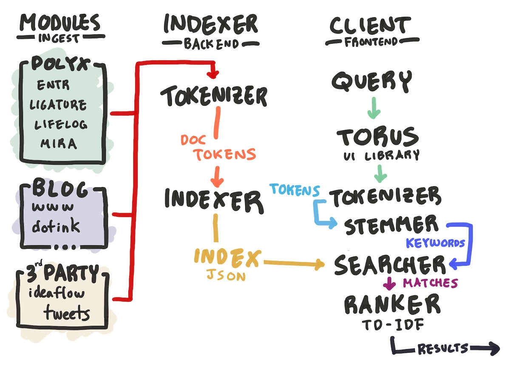

# Monocle 👓

**Monocle** is my universal, personal search engine. It can query across tens of thousands of documents from my blog posts, journal entries, notes, Tweets, contacts, and more to act as my extended memory spanning my entire life. Monocle is designed with a focus on speed, privacy, and hackability.  It's built to be very specific to the particulars of my personal workflow around data, so probably won't work for anyone else. But I might build something similar aimed for the public later. I've written more in depth about this project on [my blog](https://thesephist.com/posts/monocle/), and you can try a demo indexed on the public subset of my full data at [monocle.surge.sh](https://monocle.surge.sh/).


Like most of my side projects, Monocle is built entirely with the [Ink](https://dotink.co) programming language. The ingest and indexing pipeline is built with Ink; the application is served by an Ink web server to get some specific data compression Monocle needs, and the client web app is written in Ink with the [Torus](https://github.com/thesephist/torus) UI library.

Though it's a useful tool, Monocle was also a way for me to learn about the basics of full text search systems by writing one from scratch in Ink. As a result, its search capabilities aren't cutting edge -- they're merely good enough for my use.

## Features

I first had the idea for Monocle a long time ago, when I [tweeted about potentially building a search engine that only indexed my historical data](https://twitter.com/thesephist/status/1282795369512960001). Since then, I had come back to the idea a few times but only really started building it after writing and thinking about [incremental note-taking](https://monocle.surge.sh/?q=incremental+note-taking), where fast and effective recall is as important as quick entry into a good note-taking system.

Motivated by those ideas, Monocle is designed with a focus on speed and effective recall. To me, the following features were important:

1. **Quick time-to-first-result**. When I open Monocle to perform a search, I either already know what I'm looking for and need to find it again, or don't know what exactly I'm looking for and need to explore the list of results. In both cases, the critical variable of speed is what I call "time to first result": the time between me having the thought to search for something, and the first search result popping up on screen.

	Optimizing time-to-first-result involves a few different kinds of design decisions and technical performance metrics. The most significant among these is that I wanted results to appear live, as you type. Ideally, results would appear on every keystroke, even on slower connections. This one constraint had many consequences. This meant, for example, that the search index had to live on the client and search and ranking needed to be performed in the browser, in JavaScript. It meant I needed to optimize the index for download size, and minimize compute required on every keystroke to perform a new search.

	The result is worth it: on a modern smartphone or laptop, Monocle can search through tens of thousands of documents as you type, on every keystroke, with minimal lag, using an index a few megabytes in size.
2. **Reasonably accurate English stemming**. Monocle includes a simple, hand-written [stemming](https://en.wikipedia.org/wiki/Stemming) algorithm for the English language. It's not smart or sophisticated, and is optimized for code size and for running on queries to expand each keyword into its variations (in that way, it's more of a reverse-stemmer) since it runs on the client rather than during indexing.
3. **Static deploy with pre-compiled index**. In Monocle, the search index is an inverted index (also called a posting list) generated from the source document set at build time. This index is reused until a new index is generated, which can be done periodically. Because I didn't really have a need for ingesting documents or new notes any more frequently than a few times a week, this worked for me, and minimized work, especially on the backend where I pay for my own compute! This lets me host Monocle as a static site deployment.
4. **Keyword match highlights in both results list and preview**. Although not perfect (mostly for performance reasons), the search results listing and document previews include highlights for matches to search keywords, which makes it much easier to visually parse and understand individual search results.
5. **Pluggable architecture for easily adding new data sources**. One of the special things about Monocle is that it's designed to index any arbitrary data source in my life, from structured data like people in my contacts to free-form data like my journal entries. Monocle lets me write a small bit of Ink code to represent and ingest data from each data source, to add another data source to the search index.

## Architecture

Monocle is a static, single page web app that runs from a pre-built index of documents. Both the indexing system and the web app itself are written in Ink. Here's a high-level architecture diagram, which will look familiar if you've built a full text search engine before.



### Dataset ingestion and modules

Every data source, from my Tweet archive to my notes, has a specific Monocle "module" that corresponds to it, in `./modules`. A module's job is to take the source dataset of documents and transform the documents into a list of `Doc` objects with a specific schema that the indexer can understand. Each module exports a `getDocs(callback)` function that calls the callback with a list of `Doc`s. The schema, here conveniently represented in TypeScript's notation, is:

```ts
type Doc = {
	// A globally unique identifier for this document across all Monocle
	// documents. It's usually a 2-3 letter prefix for the module (like "tw"
	// for Tweets) followed by a number.
	id: string
	// A map of each token in the document to the number of times it appears
	// in the document.
	tokens: Map<string, number>
	// The document's text content that will be displayed in the results page
	content: string
	// Optionally, the doc's title
	title?: string
	// Optionally a link to this document on the web that Monocle can use to
	// "link out" to the original document from the search result.
	href?: string
}
```

Each module also invokes the `tokenizer` from the search library to generate that list of tokens. This is performed by the module rather than later in the indexing pipeline, because some modules may want to index metadata that isn't a part of the doc's "content". For example, I may want all my Tweets to index the name of people mentioned in it, even though they aren't mentioned in the Tweet's textual content itself.

### Indexing and the backend

Once the documents have been tokenized and the output generated by all the modules, they are handed to the `indexer`. The indexer's job is to produce the _index_, a big JSON file that represents an [inverted index](https://en.wikipedia.org/wiki/Inverted_index) mapping each word that ever appeared in any document to all documents that contained that word. This index is cached on disk alongside the generated dataset of documents, in `./static/indexes/{doc, index}.json`. They are also gzipped at build time for storage efficiency and faster downloads.

Once the index has been generated and saved, we are ready to search!

### Query expansion, searching, ranking and the frontend

The Monocle web app is a single page web app driven by the [Torus](https://github.com/thesephist/torus) UI library, which Ink wraps. Once the UI code accepts a search query (on every keystroke into the search box), here's what happens:

First, the search query string (for example `tools for thought`) is tokenized into individual words using the same tokenizer used in the indexing pipeline. This sharing of code guarantees some consistency over how words and phrases are handled. This step gives us the list `['tools', 'thought']`, since during tokenization [stopwords](https://en.wikipedia.org/wiki/Stop_word) like "for" are omitted.

Next, the tokens are sent to the `stemmer`. The stemmer's job is _query expansion_: taking a query and generating variations on each keyword to ensure we do not miss documents that may be relevant, even if they don't contain the exact keywords we typed. For example, `['tools', 'thought']` gets expanded to something like

```
(tools OR tool OR tooling OR toolment OR tooled OR tooler OR ...)
AND
(thought OR thoughts OR thoughted OR thoughtting OR thoughter OR ...)
```

This query expansion is naive and focused on English queries, but seems to work well enough for me not to miss too many results the vast majority of the time.

The expanded search query is then sent to the `searcher`. The searcher is the heart of the searching algorithm, but its job is rather simple: for each keyword in our query, use the index to find all documents that contain that keyword. Depending on the query's structure, the searcher either gathers the union or the intersection of these sets of documents.

Finally, the results need to be ordered by some measure of relevance before they're displayed to the user. For this, we turn to the `ranker`. The ranker takes all the documents returned by the searcher and ranks them according to the popular [td-idf](https://en.wikipedia.org/wiki/Tf%E2%80%93idf) metric of keyword relevance. This ranked, ordered list of results is what you see in the results section of Monocle.

All of this action happens for every search, at every keystroke into the search field in the web app. Pretty cool!

## Development and deploy

_**⚠️ Note**: If you're reading this section to try to set up and run your own Monocle instance, I applaud your audacity, but it might not be super easy or fruitful -- Monocle's modules are pretty specific not only to my data sources, but also the way I structure those files. I won't stop you from trying to build your own search index, but be warned: it might not work, and I'm probably not going to do tech support. For this reason, this section is also written in first-person, mostly for my future reference._

Monocle, like most Ink projects, (ab)uses a Makefile for development tasks. Here are the ones I currently have:

- Just `make`, or `make run`, will run the static file server that serves the Monocle web app, exactly as in my private production (not public-facing) deployment. This server serves docs and indexes from the gzippsd versions rather than plain JSON versions on disk.
- `make index` will (re-)index documents from all modules. Each module will skip work if there's a cached JSON for it in `./static/indexes`. If I want to force a module to re-generate its docs list, I can just delete that cached file.
- `make check` or `make t` will run the unit test suite for the Monocle full text search library.
- `make format` or `make f` formats all source files (outside of `./vendor`) with `inkfmt`, assuming I have it installed.
- `make build` commands (re-)build the frontend JavaScript bundle from Ink sources:
	- `make build-libs` builds the vendor bundle of dependencies and libraries. This rarely needs to be re-run.
	- `make build-monocle` builds the monocle full text search library into `./static/ink/monocle.js`.
	- `make build` builds the main app code and links up the whole bundle to `ink/bundle.js`. This is usually what I re-run every change.
	- `make build-all` Runs the whole build from top to bottom.
	- `make watch` or `make w` runs `make build` on every Ink file change.

### Generating and rebuilding indexes

Nearly all the modules, except third-party data sources mentioned below, pull data out of disk from an installation of [Noct](https://github.com/thesephist/polyx#noct), my custom file storage and sync layer shared across many of my productivity tools. Each module depends on its data being stored at a specific path within the user's Noct directory root. You can usually find this path by reading the module's source code. Running `make index` will generally do the right thing here.

For third-party data modules `tweets`, `pocket`, and `ideaflow`, I need to pre-process the data into a JSON file, and then point these modules to those files.

- For Tweets, I export my Tweets from Twitter using the archive / export feature, and save a JSON array of my Tweets with schema
	```ts
	type Tweets = {
		id: string // Tweet Snowflake ID
		content: string // Tweet full_text, with expanded entities
	}[]
	```
- For bookmarks I've saved on Pocket, I click on "Export" under "Manage your account" in the web interface to get an HTML archive of all my bookmarked notes. I do this instead of going through the API because this is much faster than waiting for Pocket's API rate limits if I simply want to get a list of URLs, which is all I need. This functionality is also accessible at [https://getpocket.com/export](https://getpocket.com/export).

	After I have that list of URLs, I open it in the browser and run the little JavaScript snippet in `modules/pocket.ink` to produce a JSON of titles and links.

	Then, I run _that_ through `node modules/pocket-full-text/index.js` which optionally downloads, parses, and re-saves a full-text archive of all of those pages using Mozilla's excellent [Readability.js](https://github.com/mozilla/readability) library. This is to make the full text of all of those bookmarked pages indexable in Monocle. This produces a JSON array saved to the specified destination file of the following format:
	```ts
	type Page = {
		title: string // document title + site name
		content: string // parsed full text of the bookmarked page
		href: string // link to the bookmarked page
	}[]
	```
	Finally, I run the indexer in `modules/pocket.ink`.
- For Ideaflow notes, I serialize my notes out to text and similarly save them into a JSON array of notes with schema
	```ts
	type Notes = {
		id: string // Note ID for deep links
		content: string // Text-serialized note content
	}[]
	```

## Future work

Monocle is reasonably feature-complete, enough for me to use it day to day without any problems or pain points. But there are some lingering ideas I'd like to try.

- Richer previews in the right pane, rendering basic Markdown and images
- Support for literal match queries (e.g. "note-taking") and `NOT` / `OR` in the query

I also want to try adding these data sources as modules.

- YouTube watch history
- The other smaller blogs I have: dotink.co, linus.coffee
